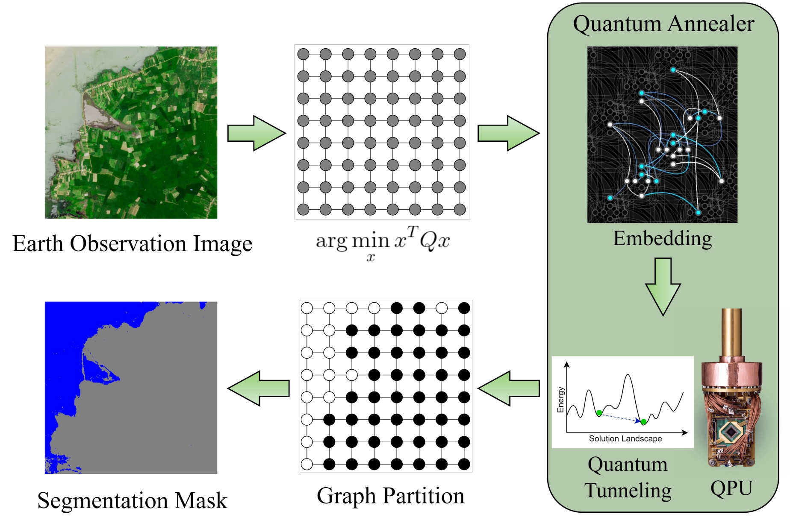
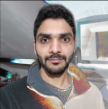
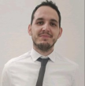

# Q-Seg: Quantum Annealing-based Unsupervised Image Segmentation

Published in the Journal Computer Graphics and Applications.
[*S. M. Venkatesh, A. Macaluso, M. Nuske, M. Klusch and A. Dengel, "Q-Seg: Quantum Annealing-Based Unsupervised Image Segmentation," in IEEE Computer Graphics and Applications, doi: 10.1109/MCG.2024.3455012.*](https://ieeexplore.ieee.org/document/10669751)

Preprint: [*Venkatesh, S. M., Macaluso, A., Nuske, M., Klusch, M., & Dengel, A. (2023). Q-Seg: Quantum Annealing-based Unsupervised Image Segmentation. arXiv preprint arXiv:2311.12912.*](https://arxiv.org/abs/2311.12912)

## Overview
[Q-Seg](https://ieeexplore.ieee.org/document/10669751) is a novel unsupervised image segmentation method leveraging quantum annealing, specifically designed for the existing D-Wave Advantage quantum hardware. It addresses pixel-wise segmentation by formulating it as a graph-cut optimization task. Q-Seg stands out for its scalability and efficiency, surpassing classical methods in runtime performance and offering competitive segmentation quality, particularly in Earth Observation image analysis.


*Figure: Overview of the Q-Seg algorithm.*

## Features
- Unsupervised segmentation using quantum annealing.
- Efficient use of D-Wave's qubit topology for scalability.
- Superior runtime performance compared to classical optimizers like Gurobi.
- Effective in scenarios with limited labeled data, such as flood mapping and forest coverage detection.

## Operational Pipeline of Q-Seg

The process of Q-Seg utilizing the D-Wave quantum annealer is illustrated in the figure below. The pipeline consists of several key steps:

1. **Converting the Image to Graph**: The image is first translated into an undirected, weighted, connected grid-graph wtih the pixels correspond to vertices and the edge weights are assigned between neighboring pixels using an appropriate similarity metric.
2. **Reformulating the Minimum Cut Problem**: The segmentation task is converted into a Quadratic Unconstrained Binary Optimization (QUBO) problem.
2. **Remote Access Authentication**: A private token is used for secure remote access to the D-Wave quantum annealer.
3. **Qubit Mapping**: The `minorminer` tool maps the logical qubits in the QUBO to the physical qubits in the D-Wave hardware.
4. **Problem Submission and Queuing**: The problem instance is transmitted over the internet and queued on the shared D-Wave device.
5. **Quantum Annealing**: The Quantum Processing Unit (QPU) on the D-Wave device performs the annealing process.
6. **Solution Extraction**: The retrieval of the sample set produced by the QPU and extracting the optimal solution based on the lowest energy state.
7. **Solution Decode**: The final step involves lowest energy binary solution string being decoded into a binary segmentation mask.


*Figure: Operational pipeline of Q-Seg using D-Wave quantum annealer.*

## Getting Started

### Prerequisites
- Python 3.9.11
- Jupyter Notebook
- Required Python packages: `numpy`, `networkx`, `qiskit`, `dwave-system`

### Installation
Clone the repository and install the required packages:
```
git clone https://github.com/supreethmv/Q-seg.git
cd Q-seg
pip install -r requirements.txt
```

### Running the Example
Navigate to the `examples` directory and open the Jupyter Notebook:
```
cd examples
jupyter notebook q_seg_pipeline.ipynb
```

Follow the instructions in the notebook to perform image segmentation on a sample grayscale image.

## Repository Structure

```
Q-Seg/
│
├── qseg/
│ ├── __init__.py
│ ├── graph_utils.py
│ ├── dwave_utils.py
│ └── utils.py
│
├── examples/ 
│ ├── q_seg_pipeline.ipynb
│ ├── Annealer_vs_Gurobi_experiments.ipynb 
│ └── plots.ipynb 
│
├── data/ 
│ ├── sample_image.jpg
│ └── results/ # Logged results from experiments
│
├── figures/ 
│ └── operational_pipeline.png
│ └── overview_pipeline.png
│
└── tutorial.ipynb 
├── requirements.txt 
└── README.md 
```

## Project Structure

### Modules in the `qseg` Package
- **graph_utils.py**: Contains `image_to_grid_graph` and `draw` functions for graph-related operations.
- **dwave_utils.py**: Includes `dwave_solver` and `annealer_solver` functions, dedicated to D-Wave specific operations and quantum annealing.
- **utils.py**: Features the `decode_binary_string` function, useful for general utility purposes across the project.

### Example Notebooks

- **tutorial.ipynb**: Located in the root directory, this notebook demonstrates the usage of Q-Seg on a sample 3 $\times$ 3 image, running the algorithm on the D-Wave Quantum Annealer accessible remotely as a cloud service. Also contains the code for solving the graph-based image segmentation task locally using classical state-of-the-art method *Gurobi*. 

- **q_seg_pipeline.ipynb**: Located in the `examples` directory, this Jupyter notebook demonstrates the usage of *Q-Seg* functions on a toy example, providing a step-by-step walkthrough of the algorithm.

-**Annealer_vs_Gurobi_experiments.ipynb**: Contains code to run experiments on a synthetic dataset.
- **plots.ipynb**: Used for parsing logged data and generating plots as shown in the paper.

### Data and Figures Directories
- Store specific data and results in the `data` directory, including a subdirectory `results` with our experiment results for different seeds.
- Place figures and diagrams in the `figures` directory.


### Dependencies
- List all required dependencies in the `requirements.txt` file, such as `qiskit_optimization`, `pylatexenc`, `dwave-ocean-sdk`, and `gurobipy`.


## Citation
If you find Q-Seg useful in your research, please consider citing our paper:
```
@ARTICLE{10669751,
  author={Venkatesh, Supreeth Mysore and Macaluso, Antonio and Nuske, Marlon and Klusch, Matthias and Dengel, Andreas},
  journal={IEEE Computer Graphics and Applications}, 
  title={Q-Seg: Quantum Annealing-Based Unsupervised Image Segmentation}, 
  year={2024},
  volume={},
  number={},
  pages={1-13},
  keywords={Image segmentation;Quantum computing;Annealing;Quantum annealing;Image edge detection;Optimization;Measurement},
  doi={10.1109/MCG.2024.3455012}
  }
```


## License

This project is licensed under the GNU General Public License v2.1 - see the [LICENSE](LICENSE) file for details.


## Contact

For any inquiries, please reach out to:

- Supreeth Mysore Venkatesh: supreeth.mysore@dfki.de
- Antonio Macaluso: antonio.macaluso@dfki.de


## Contributors

[](https://www.linkedin.com/in/supreethmv/)
[](https://www.linkedin.com/in/antonio-macaluso/)

<!--*Click on the images to visit the authors' websites.*-->


